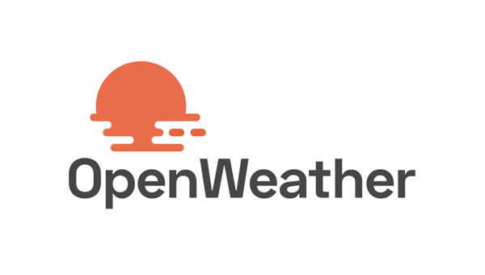
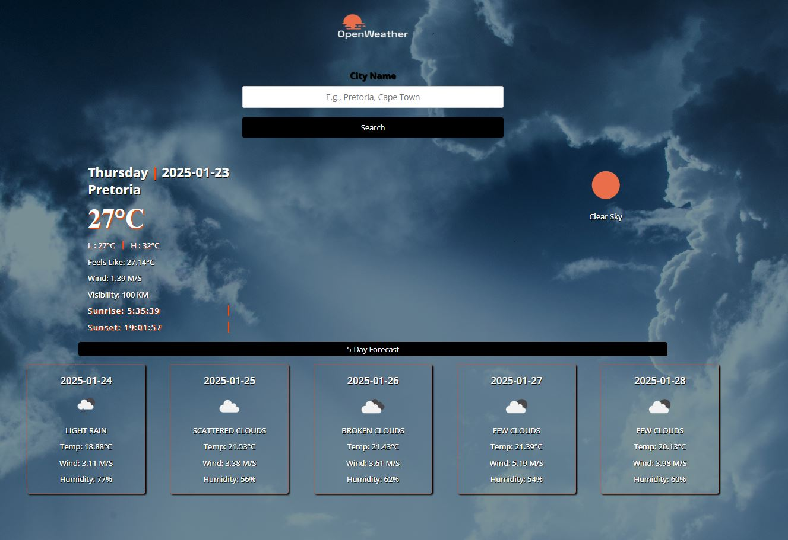

<!-- PROJECT LOGO -->
 

  

<h3 align="center">Weather app</h3>

  

    Weather application used to show forecast from OpenWeather API.
     
    <a href="https://artis-dev.github.io/weather-app/"><strong>View Demo</strong></a>
  

<!-- ABOUT THE PROJECT -->
## About The Project

Learning project from [The Odin Project](https://www.theodinproject.com/lessons/node-path-javascript-weather-app) curriculum.

### Features

* Get current and weekly forecast.
* Search cities worldwide.
* Switch between imperial and metric systems.
* Responsive design.

### Built With

#### Technologies

* JavaScript
* CSS
* HTML

#### Third party code

* [Google Fonts](https://fonts.google.com/)
* [Font Awesome](https://fontawesome.com/)

#### Tools

* Visual Studio Code
* Linux terminal
* Git and GitHub
* Webpack

<!-- OUTCOME -->
## Outcome

* Used revealing module pattern for better code organizing.
* Used public API to get data.
* Used Webpack to build the app.
* Used third-party library for date and time formating.
* Used CSS3 grid and flex to create layout.
* Used HTML5 semantic elements for better readability and structure.
* Used Git and GitHub for project management.
* Learned error handling a bit.
* Tried to maintain clean code.
* Cross tested on Firefox and Chromium based browsers.

(<a href="#top">back to top</a>)

